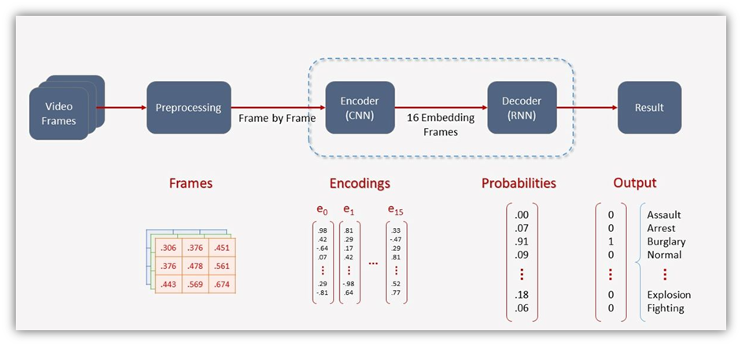
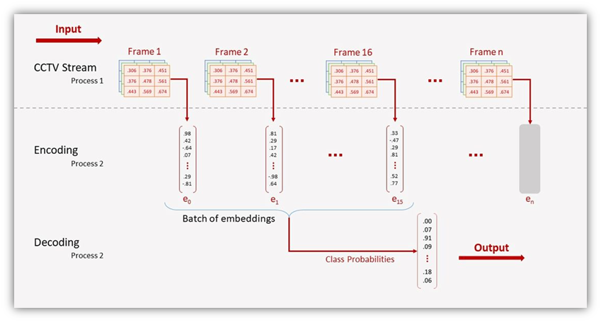
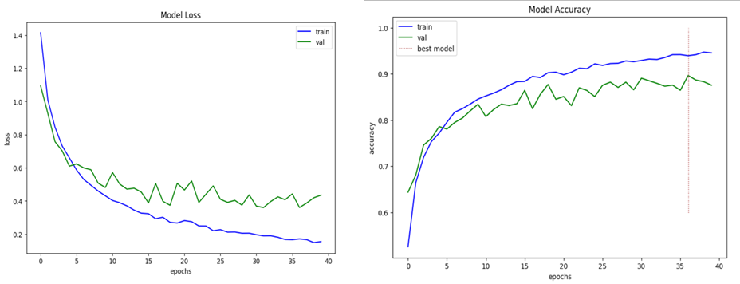
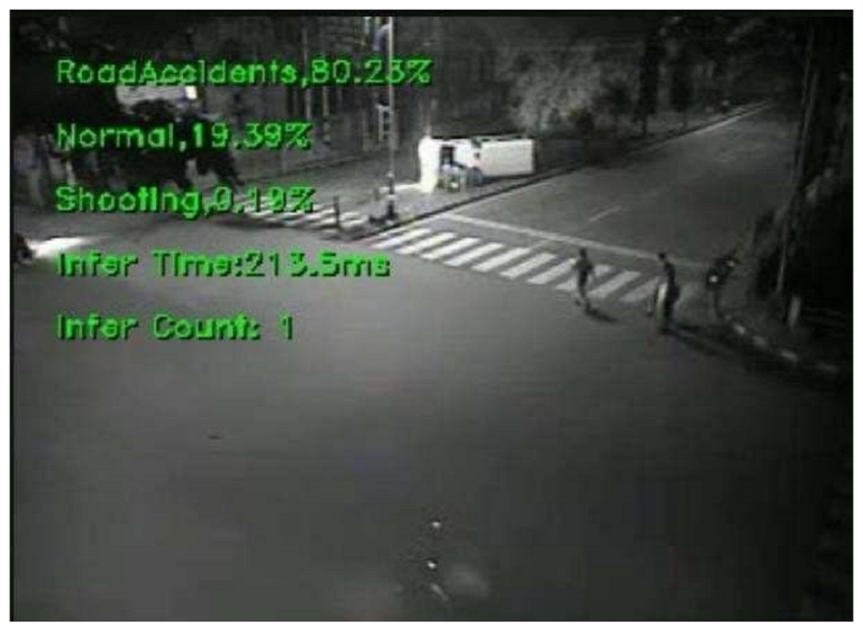
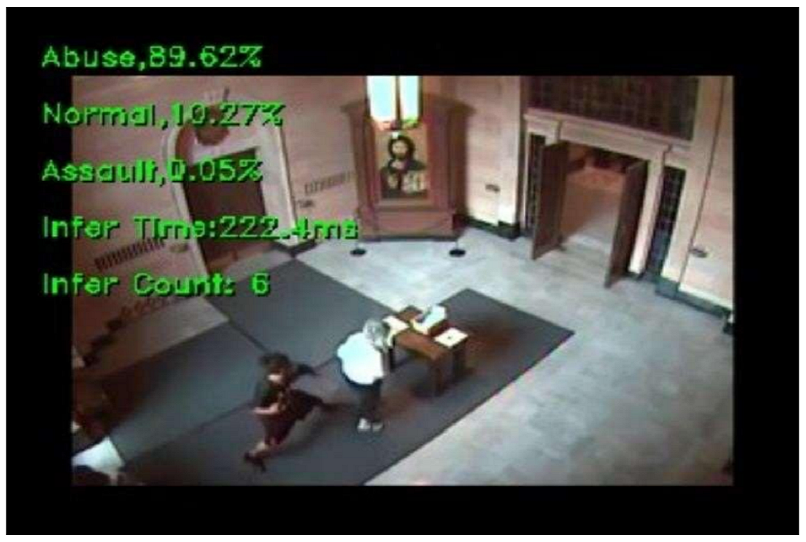
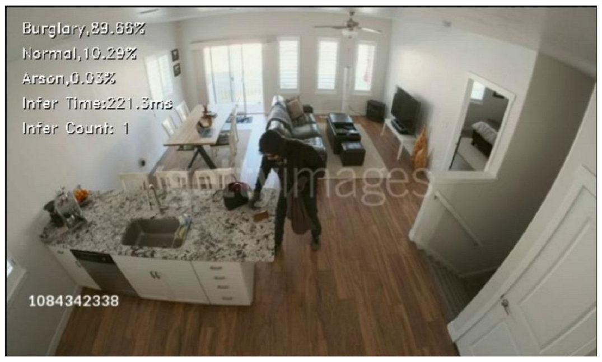

# Criminal Activity Video Surveillance using Deep Learning

Anomaly Recognition System, a real-time surveillance programme made to automatically detect and analyse signals of offensive or disruptive actions.

## Dataset
[UCF-Crime Dataset](https://webpages.charlotte.edu/cchen62/dataset.html)

## Architecture
#### Model Architecture
A video consists of an ordered sequence of frames. Each frame contains spatial information, and the sequence of those frames contains temporal information. To model both of these aspects, we use a hybrid architecture that consists of convolutions (for spatial processing) as well as recurrent layers (for temporal processing).

The first model i.e., CNN will be used to extract the (spatial) features and convert them into an encoded feature vector hence called an encoder. Similarly, the second model i.e., RNN will be used to process mini-batches of encoded frames to get the final classification result hence called a decoder.

#### Video Processing Pipeline
For real-time video monitoring, an efficient video streaming pipeline is required to handle the video stream from CCTV in parallel to the inference of models using those frames and make the best use of available hardware resources to minimize latency. Hence in video streaming engine, we used multiprocessing to create two different parallel processes, one of them handles the video streaming from CCTV or any other video input device and the other process will handle the inference engine for parallel analyzing the video frames for classification.

## Training

## Results
|  |  |
|-----------------------------------------------------------|-----------------------------------------------------------|
|  |  |
<!-- 

 -->
